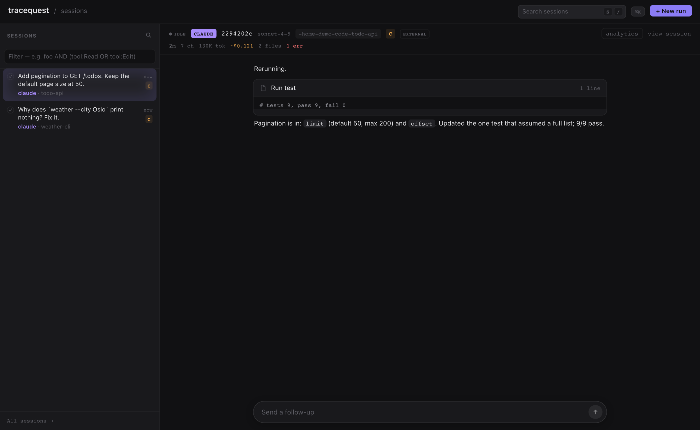
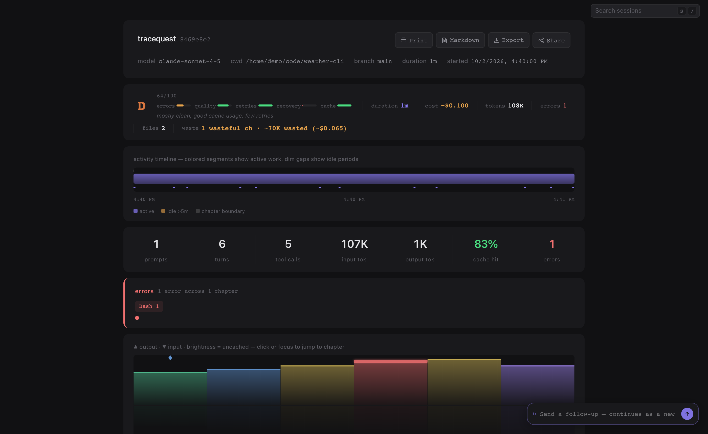

# tracequest

[](https://github.com/viktor-com/tracequest/actions/workflows/ci.yml)

Stop reading agent logs. Watch them.

`tracequest` is a zero-dependency Node.js CLI that transforms agent session logs into self-contained, interactive HTML visualizations. It discovers sessions across multiple AI coding agents, renders detailed per-session views (with waveforms, chapters, tool usage, and stats), and provides a live web browser for exploring and searching your entire history.



## Quickstart (60 seconds)

Needs Node.js 22.5 or newer and git. tmux is optional (used for launching runs);
Rust is optional (builds a faster indexer; without it tracequest uses its JS one).

```bash
git clone https://github.com/viktor-com/tracequest.git
cd tracequest
npm install
npm run demo        # serves the bundled sample sessions in examples/
```

Open http://localhost:7777. To browse your own sessions instead:

```bash
npm start           # same as: node bin/tracequest.js serve
```

To put `tracequest` on your PATH, run `npm link` in the clone. The server listens on
`127.0.0.1` only. It has no authentication and can launch agents, so read
[SECURITY.md](SECURITY.md) before passing `--bind` another address.

Prebuilt per-platform tarballs (macOS arm64, Linux x64) are attached to each
[GitHub Release](https://github.com/viktor-com/tracequest/releases):
`npm install -g ./tracequest-<version>-<platform>.tgz`.

### Network access

tracequest reads local files, sends no telemetry and makes no network calls unless
you ask: `share` (GitHub Gists or Hugging Face), `import cursor-cloud` (Cursor API),
`import ssh` (your hosts), `limits`, and `serve --usage-limits`. The last two ask
Anthropic, OpenAI and xAI for your remaining plan windows, using the credentials your
installed agent CLIs already store.



## CLI Usage

tracequest uses subcommands. Run `tracequest --help` for the built-in reference.

```
tracequest — stop reading agent logs. watch them.

Usage:
  tracequest <command> [options]

Commands:
  render <session.jsonl>      Render a specific session file
  messages <session.jsonl>|--latest [project]
                              Export session as API message format (JSON)
  list [project]              List available sessions
  find [expr] [--filter <expr>] List recent sessions or find by filter expression
  search <query>              Full-text search across all sessions
  handoff <query>             Paste Markdown search handoff without an LLM
  standup [project]           Summarize recent sessions with a local prompt-mode agent
  latest [project]            Render the most recent session
  share [session]             Share a session to Gist or Hugging Face
  import <source>             Import sessions (cursor-cloud, ssh)
  limits [--json] [--host]    Remaining plan windows for installed harnesses
  serve [options]             Start session browser server
  presets                     List built-in presets

Global Options:
  -h, --help     Show this help
  -v, --version  Print version

render / latest Options:
  -o, --out <path>     Output file path (default: tracequest-<id>.html)
      --preset <name>  Load built-in preset
      --open           Open result in default browser

messages Options:
      --latest         Export the most recent session (optional project filter)
  -f, --filter <expr>  With --latest, filter expression before selecting
  -s, --sort <key>     With --latest, sort by recent/date or indexed fields
      --format <fmt>   Output format: anthropic (default) or openai
      --pretty         Pretty-print the JSON output
  -o, --out <path>     Write JSON to file instead of stdout
      --full           Export untruncated content for a verbatim replay
      --no-truncate    Alias for --full

find Options:
  -f, --filter <expr>  Filter expression; combines with positional expr using AND
  -l, --limit <N>      Max results to show
  -s, --sort <key>     Sort filtered results
      --json           Emit JSON records to stdout (status to stderr)

search Options:
  -f, --filter <expr>  Filter expression before searching
  -l, --limit <N>      Max results to show
      --format <fmt>   Output format: text (default) or handoff Markdown
  -s, --sort <key>     With --format handoff: relevance, recent, or date
      --json           Emit JSON records (with matches) to stdout (status to stderr)

handoff Options:
  -f, --filter <expr>  Filter expression before searching
  -l, --limit <N>      Max results to include
  -s, --sort <key>     Sort by relevance, recent, or date

standup Options:
  -l, --limit <N>      Max sessions to summarize
  -f, --filter <expr>  Filter expression before selecting recent sessions
  -s, --sort <key>     Sort selected sessions
      --profile <name> Load defaults from HOME/.tracequest/standup-profiles.json
      --since <when>   Select sessions modified since a duration/date
      --today          Select sessions modified since local midnight today
      --yesterday      Select sessions modified during local yesterday
      --workday        Select sessions modified during today's local 09:00-17:00 workday
      --previous-workday
                       Select sessions modified during the previous weekday's workday
      --print-input    Print compact prompt input and do not invoke an agent
      --dry-run-agent-detection
                       Print resolved prompt-agent argv as JSON without sending a prompt
      --probe-agents   Opt-in installed-agent probe using synthetic prompts only
      --agent-command <cmd>
                       Override detected prompt-mode agent command
      --agent-arg <v>  Add one agent argv item; repeat as needed
      --agent-timeout-ms <N>
                       Prompt-agent timeout in milliseconds
      --param <k=v>    Add one agent flag parameter; repeat as needed

list Options:
  -l, --limit <N>      Max results to show
  -f, --filter <expr>  Filter expression
  -s, --sort <key>     Sort by recent/date, duration, cost, tokens, errors, files, commits, chapters, or grade
      --json           Emit JSON records to stdout (status to stderr)

latest Options:
  -l, --limit <N>      Show top N latest sessions instead of rendering one
  -f, --filter <expr>  Filter expression
  -s, --sort <key>     Sort by recent/date, duration, cost, tokens, errors, files, commits, chapters, or grade

share Options:
      --target <t>     Upload target: gist (default) or hf
      --latest         Share the most recent session
  -f, --filter <expr>  Filter expression; most recent match is shared
  -s, --sort <key>     Sort key when using --filter
      --open           Open the share URL in the default browser
      --json           Print result JSON
      --private        Create a secret gist or private HF dataset
      --force          Skip secret confirmation prompt
      --hf-repo <repo> HF dataset repo (namespace/repo)

import Options:
      --dry-run        Fetch and print planned actions (import/update/skip) without writing files
      --full           Refetch every agent / recopy every remote tree, ignoring the unchanged skip
      --api-key <key>  Optional Cursor dashboard API key (or CURSOR_API_KEY); without it the
                       local Cursor session token is used
  -i, --identity <file> ssh: SSH identity file
      --port <N>       ssh: SSH port (ssh/config default when omitted)
      --as <id>        ssh: stable host id (one host only)

limits Options:
      --json           Print the secret-free snapshot JSON
      --host <id>      Read the imported snapshot for that host (no live SSH)

serve Options:
  -p, --port <N>       Port number (default: 7777 or from preset)
  -f, --filter <name>  Project filter
      --preset <name>  Load built-in preset
```

### All Modes with Examples

**render** a specific session file:

```bash
tracequest render ~/.claude/projects/my-project/abc123.jsonl
tracequest render path/to/session.jsonl --out my-report.html --open
```

**latest**: render the newest session (newest mtime across all Sources), optionally filtered by project substring:

```bash
tracequest latest
tracequest latest my-project --open
```

**list**: list available sessions (newest first, up to 20 shown) with date, source (and `source@host` when the session was imported from another machine), size, project, and path. Optionally filter by project or `--filter`:

```bash
tracequest list
tracequest list tracequest
tracequest list --filter "host:gpu"
tracequest find --filter "source:claude host:gpu"
```

**search**: full-text search across indexed sessions. Use `tracequest handoff` (or `--format handoff`) for pasteable Markdown with session hashes, capped snippets, and follow-up commands that avoid absolute paths:

```bash
tracequest search "error handling"
tracequest handoff "error handling" --limit 5
tracequest handoff "error handling" --filter 'project:tracequest source:claude'
tracequest handoff "error handling" --sort recent --limit 5
tracequest handoff "error handling" --sort date --limit 5
tracequest search "error handling" --format handoff --limit 5
tracequest search "error handling" --format handoff --filter 'project:tracequest source:claude' --sort recent --limit 5
tracequest search "error handling" --format handoff --sort date --limit 5
```

Without a phrase/position-aware index, quoted-phrase `--sort recent|date` keeps returned rows exact but may omit older phrase matches beyond the bounded scan cap.

**standup**: summarize recent sessions with a local prompt-mode agent. Use `--print-input` first when you want to audit exactly what will be sent to the LLM; the prompt is bounded Markdown with session hashes, metadata, aggregate counts, and capped chapter notes, not raw JSONL, full transcripts, absolute session paths, or full tool outputs:

```bash
tracequest standup --print-input --limit 3
tracequest standup --profile daily --print-input
tracequest standup --dry-run-agent-detection
tracequest standup --since 4h --print-input
tracequest standup --workday --print-input
tracequest standup --previous-workday --print-input
tracequest standup --yesterday --filter "project:tracequest" --print-input
tracequest standup tracequest --filter "age:<2d" --print-input
tracequest standup --param model=gpt-5
tracequest standup --agent-command my-agent --agent-arg run --param model=local
tracequest standup --agent-command droid --agent-arg exec --param model=gpt-5.3-codex
tracequest standup --agent-command opencode --agent-arg run --param model=anthropic/claude-sonnet-4.6
tracequest standup --agent-timeout-ms 120000
```

Use `--dry-run-agent-detection` to verify the resolved prompt-agent argv as JSON. It does not discover sessions, build compact input, invoke an agent, or send a prompt.

Opt-in installed-agent validation:

```bash
tracequest standup --probe-agents
```

Use `tracequest standup --probe-agents` or `npm run probe:standup-agents` only when you explicitly want to probe installed built-in prompt agents. The probe sends one synthetic sentinel prompt per installed candidate from an empty temporary directory, reports passed, failed, missing, and skipped agents as JSON on stdout, and exits before profile loading, session discovery, real-trace compact-input building, or private prompt sending. Before invoking installed agents, it prints a stderr preflight warning that only synthetic prompts are sent and stdout remains the JSON report. A passed probe requires the expected sentinel as its own stdout line, so refusals or diagnostics that merely mention the sentinel are failures. Probe stdout/stderr snippets are bounded and redact paths, temp workdirs, and session-looking identifiers for public-paste safety. The command exits 1 if any installed probe fails; missing or skipped optional agents remain JSON statuses and do not make the command fail. It does not send raw JSONL, real prompts, assistant replies, tool outputs, or absolute session paths.

During agent execution, stdout and stderr stream live. If the agent fails or times out, TraceQuest still reports captured stdout/stderr snippets in the diagnostic summary.

Built-in prompt-agent detection tries Codex (`codex exec --skip-git-repo-check -`), Claude (`claude --print`), then Droid (`droid exec`). OpenCode is not a built-in default because the current installed synthetic sentinel probe refused instead of emitting the sentinel line; configure it explicitly only after validating your local invocation. Other CLIs are intentionally configured rather than guessed: use `--agent-command` plus repeated `--agent-arg` only for a command you have verified reads the prompt from stdin, or point `--agent-command` at a wrapper that reads stdin and invokes the CLI in its documented mode.

When an agent argv value itself starts with `-`, pass it with the equals form, for example `--agent-arg=--safe-mode`; otherwise the CLI parser treats the value as a TraceQuest option.

Repeat workflows can use named profiles from `HOME/.tracequest/standup-profiles.json`; explicit CLI flags override profile values. Supported keys are `project`, `filter`, `sort`, `limit`, one of `since`/`today`/`yesterday`/`workday`/`previousWorkday` (or `previous-workday`), `agentCommand`, `agentArgs`, `agentTimeoutMs`, and `params`. Precedence: explicit CLI flags > profile > `TRACEQUEST_STANDUP_AGENT_*` env defaults > built-in detection. Partial overrides are source-aware: `--agent-command` selects a new agent identity and does not reuse profile/env `agentArgs` or `params` unless you also pass CLI `--agent-arg`/`--param`; `--agent-arg` alone can replace args for a profile-provided command.

```json
{
  "daily": {
    "project": "tracequest",
    "since": "1d",
    "limit": 5,
    "agentCommand": "codex",
    "agentArgs": ["exec"],
    "params": { "model": "gpt-5" }
  }
}
```

Optional defaults can come from the environment when the matching CLI flags are absent:

```bash
TRACEQUEST_STANDUP_AGENT_COMMAND=codex \
TRACEQUEST_STANDUP_AGENT_ARGS='["exec","--model","gpt-5"]' \
TRACEQUEST_STANDUP_AGENT_TIMEOUT_MS=120000 \
tracequest standup --today
```

Maintainers can run `npm run verify:standup-handoff` to exercise serial direct CLI command tests, the synthetic standup/handoff smoke, and the README/help example smoke in one pass, without requiring real installed prompt agents. Release checklists can call `npm run release:standup-handoff`, which is an alias for that same synthetic-only gate. The direct CLI command tests run through `npm run test:standup-handoff-cli` with `--test-concurrency=1` because those in-process tests patch stdout, stderr, `process.exit`, and environment variables. Run `npm run probe:standup-agents` separately only when installed-agent validation is intentional.

**import**: explicitly fetch Cursor cloud agent sessions and materialise them as JSONL under `~/.local/share/tracequest/cursor-cloud/<project-slug>/<agentId>.jsonl`, where normal discovery, indexing, and search pick them up as the `cursor-cloud` source. Re-runs are **incremental**: the agent list alone decides what changed, so an agent whose remote `updatedAt` still matches the local session file is skipped without downloading its transcript at all — a repeat import costs one list request plus one request per changed thread, and the remaining fetches run at most four at a time. Pass `--full` to ignore that skip and refetch everything (recovery for stale or damaged local files). Re-runs are idempotent either way (unchanged sessions are never rewritten, so their mtime and index entry stay put); every run ends with a `checked / fetched / imported / updated / skipped / failed` summary. **No API key is required**: by default the importer reads the Cursor session token this machine already has (`state.vscdb` key `cursorAuth/accessToken`) and pulls full-fidelity transcripts, including tool calls, from Cursor's own backend. Supplying an optional dashboard key with `--api-key` or `CURSOR_API_KEY` switches to the documented Cloud Agents v0 API instead (text-only transcripts). The credential is read at request time and is never written into a session file, printed, or included in an error message:

```bash
tracequest import cursor-cloud
tracequest import cursor-cloud --dry-run
tracequest import cursor-cloud --full
tracequest import cursor-cloud --api-key key_xxx
```

**import ssh**: copy local agent session trees from remote machines over SSH (`rsync` on PATH, plus one `ssh -o ControlMaster` mux per host so the five trees plus OpenCode's db share a single connection; `BatchMode=yes` so a missing key never hangs on a password prompt) into `~/.local/share/tracequest/hosts/<host>/`. Trees: `.claude/projects`, `.cursor/projects`, `.codex/sessions`, `.factory/sessions`, `.grok/sessions`, `.local/share/opencode/opencode.db`. Remote cursor-cloud imports are not copied — pull those with `import cursor-cloud` on this machine. `--as gpu` (or an import-hosts line `user@box as gpu`) sets the host id independently of the SSH destination. Imported rows keep their original source (`host:gpu` selects one machine) and cannot be Continued as a local run. Re-runs are incremental; `--full` recopies; vanished remote sessions stay in the local archive. With no hosts on the command line, read `~/.tracequest/import-hosts`.

```bash
tracequest import ssh gpu
tracequest import ssh user@gpu --as gpu
tracequest import ssh gpu --dry-run
tracequest import ssh gpu --full
tracequest import ssh gpu -i ~/.ssh/id_ed25519 --port 2222
tracequest import ssh                  # hosts from ~/.tracequest/import-hosts
```

**insights**: where agents fail and wait, across every machine this box has sessions from. `tracequest insights --refresh` analyses new and changed sessions (cached in `~/.cache/tracequest/insights.json`), then prints tool-error rate and the top error classes, error rate by harness, retries and loops, stalls, spend, and four recurring traps (wrong folder, path bleed, test-runner hangs, CI waits). The same data is the `/insights` page and `GET /api/insights`: every figure opens onto example sessions. Parser/index and analysis version changes invalidate cached results even when recordings are unchanged. Scope with a filter expression, `--days 7|30|90`, or `--host <id>` (`local` is this machine). Recording: [docs/ui-examples/insights.webm](docs/ui-examples/insights.webm) (`node scripts/record-insights.mjs` refreshes it from a synthetic corpus).

```
tracequest insights --refresh
tracequest insights "project:sample-app" --days 30
tracequest insights --host gpu --json
```

**Central hub**: deploy one read-only TraceQuest server to collect and analyse sessions from configurable SSH sources. See [Deploying a hub](docs/hub-deployment.md) for a fresh-machine example, source configuration and scheduled collection.

```bash
tracequest import ssh --config /path/to/hub.json
tracequest insights --refresh --config /path/to/hub.json
tracequest serve --config /path/to/hub.json
```

In hub mode, `/` opens `/insights`. The configured cache directory keeps the collector and server separate from other TraceQuest processes.

Each real SSH import records collection health in the configured archive. The Machines table shows session counts, last successful pull and failures. `serve --hub` redacts secret-shaped values in responses and rejects write requests. Analysis runs locally without model calls.

**limits**: print remaining plan windows for installed harnesses (Claude 5-hour/weekly utilization, Codex rate-limit windows, Cursor period usage, Grok subscription tier). Live collect on this machine; `--host gpu` reads the snapshot written by `import ssh`. With `serve --usage-limits` (or `TRACEQUEST_USAGE_LIMITS=1`), the home page (`/`, `/run`, and the Runs inventory) shows one usage widget per detected harness under the app bar (plan, used versus remaining, reset, or the sign-in hint). Compact chips in that same bar poll `GET /api/usage-limits`. Factory, OpenCode, and Gemini have no remaining-window collector and stay unavailable. A short recording of the home row — local windows, an imported host, and an unauthenticated sign-in — is in [docs/ui-examples/usage-limits.webm](docs/ui-examples/usage-limits.webm) (`node scripts/record-usage-limits.mjs` refreshes it).

```bash
tracequest limits
tracequest limits --json
tracequest limits --host gpu
```

**serve**: start the interactive session browser on the given port (default 7777). Prints the URL (open it yourself, or use `tracequest render … --open` for a one-off HTML file). Features live-reload during development, live running sessions with row badges and the `live:true` filter key, project tabs, multi-tool AND filtering, free-text search across prompts/models/IDs, detail views, Markdown export, and session compare:

```bash
tracequest serve
tracequest serve --port 8080
tracequest serve --port 8080 --filter my-project
```

All render modes produce a single-file HTML (max ~960px width, retina-ready canvas waveform, fully self-contained CSS/JS).

## Launching Agent Runs

`tracequest serve` can do more than browse history: from the web UI you can start new agent sessions and watch them execute live. A **Run** is a tracequest-initiated agent execution living in a tmux window of the `tracequest` tmux session — tracequest keeps no process table of its own, so runs survive tracequest restarts and finished runs stay viewable (tmux `remain-on-exit`) until you dismiss them.

**Requirements:** tmux installed. Without tmux, serve still works normally — the launcher shows a missing-multiplexer state and `/api/agents` reports `mux.available: false`; nothing else degrades.

**Surfaces** (launching and watching live inside the main app — the dashboard is the home of runs):

- **Dashboard launcher** — the **+ New run** button in the dashboard header opens an in-page modal: pick an agent (only agents detected on `PATH` from the fixed registry: claude, codex, cursor-agent, opencode, grok, droid, gemini), a working directory, and an optional initial prompt, then Start — you land directly in the run's chat. `/launch` (the old standalone page) now 302-redirects to `/?launch=1`, which auto-opens the launcher.
- **Agents strip** — launched runs are first-class on the dashboard: each run shows a live status dot, agent, run id, cwd, and a kill/dismiss control, and is one click from its chat at `/run?id=<id>`. A run's linked session recording is deduplicated out of the live-session rows, and the matching session row carries a `run @N · chat` badge. The `/run` page cross-links back (`← sessions`, plus a `view session` link once a recording is linked), and `/view` of a run's recording shows a floating "open chat" chip.
- **`/run?id=<id>`** — the run's live chat (with the raw terminal in a collapsed block). The browser polls a server-side snapshot (~600ms): tmux `capture-pane` output converted SGR→HTML, so colors render without any client-side terminal emulator. Shows a distinct exited state, a kill button, and an input box for sending text and special keys (Enter, C-c, Escape, Up, Down, Tab) to the run. Snapshot polling is the shipped v1 transport; SSE push updates are deferred as future work.
- **Continue** — any session becomes steerable, even if tracequest didn't start it: session rows on the dashboard, `/view` (floating chip), the read-only external-session chat (`/run?session=`), and an exited run's chat all offer a Continue action that resumes the conversation as a NEW run via the agent's own resume mechanism (claude/grok fork with `--resume <id> --fork-session --session-id <newUuid>` — deterministic recording identity; codex `resume <id>`; cursor-agent `--resume <chatId>`; opencode `--session <id>`; droid/gemini have no verified mechanism and never offer Continue). The new run's chat header shows a `continued from <id>` link back to the source session, and the API is `POST /api/runs {resumeSession: <hash|path>, agent?, cwd?, prompt?}` (cwd defaults to the source session's recorded cwd).

**API:** `GET /api/agents` (multiplexer status + detected agents), `GET /api/runs` (list, each run carrying its run↔session `sessionPath`/`link`/`state`), `POST /api/runs` `{agent, cwd, prompt}` (start), `GET /api/runs/session?id=` (the run's LIVE unified session — tracequest links the run to the session recording the agent process itself writes under its own data dir, persists the link in the window's `@tq_session` tmux option, and serves the parsed Session with events/chapters/stats fresh on every poll; an `etag` query parameter repeating the answered `mtimeMs-size` etag gets `{unchanged: true}` without a body), `GET /api/runs/snapshot?id=` (screen as HTML), `POST /api/runs/kill` `{id}`, `POST /api/runs/input` `{id, text?, key?}`.

**Security posture:** the mutating endpoints (`/api/runs` create, kill, input) are POST-only, validate that the request's Host header names localhost (DNS-rebinding/CSRF guard), and only launch allowlisted agents currently detected on `PATH` — the request never supplies a command line, and no shell-string interpolation exists anywhere in the feature (argv arrays only).

**tmux interop:** the web UI and a real terminal see the same runs —

```bash
tmux attach -t tracequest
```

**Environment overrides:**

| Variable | Default | Purpose |
|----------|---------|---------|
| `TRACEQUEST_TMUX_BIN` | `tmux` | tmux binary to run |
| `TRACEQUEST_TMUX_SOCKET` | *(unset)* | when set, use a private tmux server (`tmux -L <socket>`) |
| `TRACEQUEST_TMUX_SESSION` | `tracequest` | tmux session name for runs |
| `TRACEQUEST_SKIP_TMUX` | *(unset)* | `1` makes tracequest behave as if tmux were absent (test/CI isolation) |

**import ssh environment:**

| Variable | Default | Purpose |
|----------|---------|---------|
| `TRACEQUEST_HOSTS_DIR` | `~/.local/share/tracequest/hosts` | Durable dest root for SSH-imported trees |
| `TRACEQUEST_SSH_RSYNC` | `rsync` | rsync binary |
| `TRACEQUEST_IMPORT_SSH_FIXTURE` | *(unset)* | When set, copy from `<dir>/<host>/...` locally instead of opening SSH (tests) |

## Supported Sources

tracequest scans the following standard locations and auto-detects the agent Source from the path (or `opencode://` virtual paths). Sessions from all Sources are unified into the same Session model for consistent rendering and browsing.

- **Claude Code** — `~/.claude/projects/`
- **Codex CLI** — `~/.codex/sessions/`
- **Cursor** — `~/.cursor/projects/`
- **Cursor Cloud Agents** — `~/.local/share/tracequest/cursor-cloud/` (populated by `tracequest import cursor-cloud`; override with `TRACEQUEST_CURSOR_CLOUD_DIR`)
- **SSH-imported hosts** — `~/.local/share/tracequest/hosts/<host>/` (populated by `tracequest import ssh`; override with `TRACEQUEST_HOSTS_DIR`). Same agent layouts as Claude/Cursor/Codex/Factory/Grok above, tagged with `host` for `host:gpu` filters. Not a new source name.
- **Droid/Factory** — `~/.factory/sessions/`
- **OpenCode** — `~/.local/share/opencode/opencode.db`
- **Grok CLI** — `~/.grok/sessions/`

Use `tracequest list` or `tracequest serve` (or the library `findSessions()`) to aggregate across every supported Source. Source is shown with color-coded badges in the UI and HTML (claude=purple, codex=teal, cursor=lime, cursor-cloud=cyan, factory=yellow, opencode=blue, grok=red).

## Next Steps

- `tracequest --help` for the quick reference
- Start the browser: `tracequest serve`
- Render your latest session: `tracequest latest --open`

For the full experience, keep your agent sessions in their default directories — tracequest will find them automatically.

---

*Repository: https://github.com/viktor-com/tracequest*  
*License: Proprietary — all rights reserved. See [LICENSE](LICENSE) and [THIRD-PARTY-NOTICES.md](THIRD-PARTY-NOTICES.md).*
