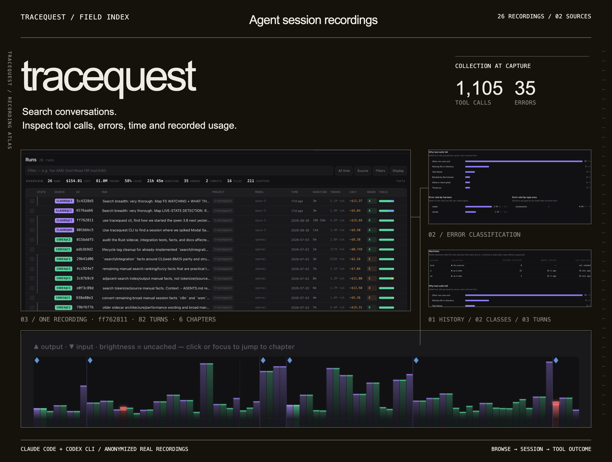
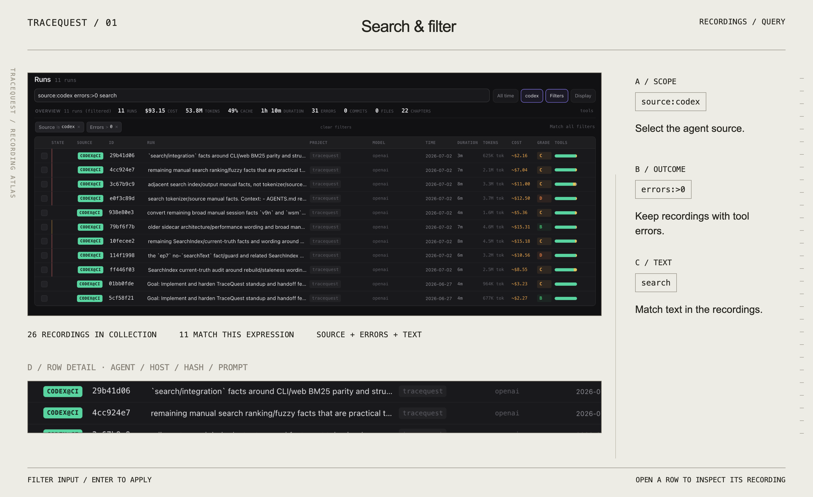
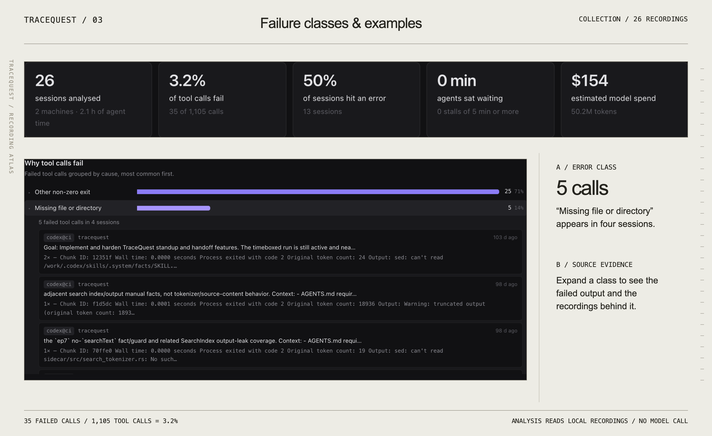
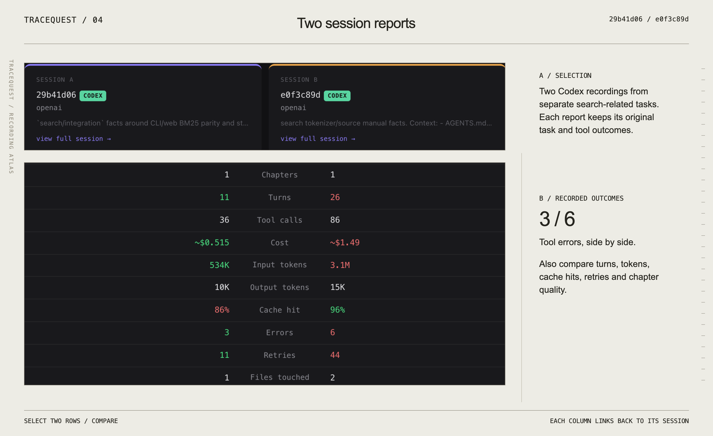
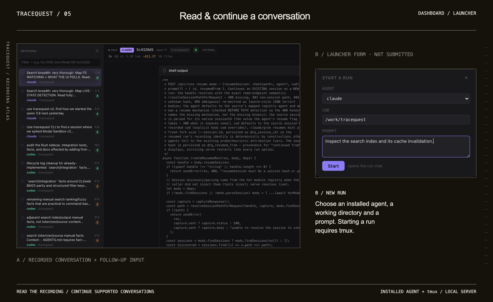
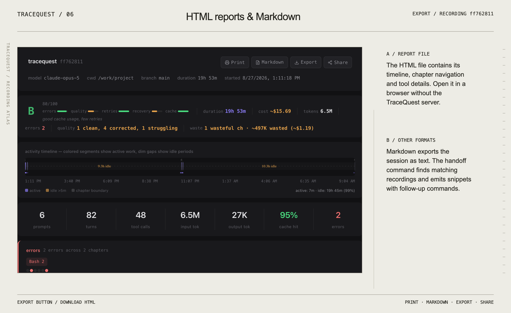
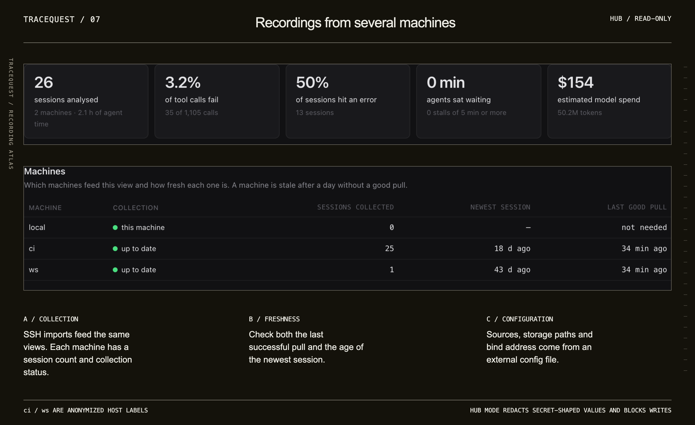

# tracequest



TraceQuest reads coding-agent recordings and shows their conversations, tool calls,
errors, activity and recorded token usage. Browse Claude Code, Codex CLI, Cursor,
Droid/Factory, OpenCode and Grok CLI sessions. Import Cursor Cloud Agent recordings
or collect sessions from other machines over SSH.

[Try it](#try-it) · [Features](#features) · [Technical docs for your coding agent](docs/README.md)

The images below show 26 real development recordings, anonymized and excerpted
before capture. Names, machine labels, paths and credentials were redacted;
recorded timestamps, tool outcomes and usage were retained. Cost figures are
estimates from recorded usage and model prices, not subscription bills.

## Features

### Search and filter recordings



Search conversation text and filter by project, source, machine, model, tool,
errors or age. The overview recalculates for the matching sessions.

**Open:** start the browser with `npm start`, choose **All sessions**, enter a filter
such as `source:codex errors:>0 search`, and press **Enter**. From a source checkout,
`node bin/tracequest.js search "cache invalidation"` searches from the terminal.
[Search commands and filters](docs/cli-reference.md#cli-usage).

### Inspect a session


The activity timeline separates active work from idle gaps. The waveform shows
token input and output by turn, with markers for chapters and tool errors.
Chapters contain the original prompts, commands, outputs and retry details.

**Open:** open a recording, choose **view session**, and click a bar or chapter.
`node bin/tracequest.js latest --open` opens a report for your latest session.
[Rendering and export options](docs/cli-reference.md#cli-usage).

### Inspect failure patterns



Insights groups failed tool calls by cause and shows error rates, retries, loops,
active time and estimated cost. Expand a row to read the failed output and open
its source session. Filters scope the analysis by project, source, machine or time.
Analysis runs locally without model calls.

**Open:** visit `/insights` on your TraceQuest server.
`node bin/tracequest.js insights --refresh` updates the analysis and prints a
summary in the terminal. [Insights options](docs/cli-reference.md#cli-usage).

### Compare two sessions



Compare duration, tokens, cache usage, errors, retries, tools and chapter quality.
Each column links to its full session. The recordings shown are different tasks;
the comparison describes their recorded work.

**Open:** in **All sessions**, select two row checkboxes and choose **Compare**.
[Browser and session commands](docs/cli-reference.md#cli-usage).

### Read, launch and continue conversations



Read recorded messages and tool output in the conversation view. Launch an
installed agent from **+ New run**, send follow-ups, or continue supported
conversations. Launching and continuing runs requires tmux. The form shown is
unsubmitted; the conversation is a recorded session.

**Open:** run `npm start` and choose a conversation or **+ New run**.
[Supported agents, continuation and setup](docs/cli-reference.md#launching-agent-runs).

### Export reports and prepare handoffs



**Export** downloads an HTML report with its timeline and chapter navigation.
**Markdown** exports session text. The `handoff` command searches recordings and
returns Markdown snippets with commands for inspecting the matching sessions.

**Run:** open a session and choose **Export** or **Markdown**, or run
`node bin/tracequest.js handoff "cache invalidation" --limit 5` from the checkout.
[Handoff and sharing options](docs/cli-reference.md#cli-usage).

### Collect sessions from several machines



Collect recordings over SSH into a read-only hub. The Machines table shows each
source's session count, newest recording, collection status and last successful
pull. An external config file selects sources, archive paths and server address.

**Run:** follow the [hub deployment guide](docs/hub-deployment.md) to create a
config, import recordings and start the hub. The guide includes a local sample
for a fresh machine. Hub mode blocks writes and redacts secret-shaped values;
network access still needs protection because recordings contain conversation text.

## Try it

Requires **Node.js 22.5+** and **git**.

```bash
git clone https://github.com/viktor-com/tracequest.git
cd tracequest
npm install
npm run demo
```

Open [localhost:7777](http://localhost:7777) to browse two bundled synthetic sample
sessions. The demo needs no agent account or API key. Its sample sessions differ
from the anonymized recordings illustrated above.

To browse your own recordings, stop the demo with **Ctrl-C**, then run:

```bash
npm start
```

[Installation, imports and troubleshooting](docs/README.md#start-here).

## Data and network access

Browsing and analysis read local files. TraceQuest sends no telemetry. Sharing,
remote imports and optional usage-limit checks contact their services when
requested. Standup summaries and launched agents use your configured agent.

The server listens on localhost by default and has no built-in login. Read the
[deployment guide](docs/hub-deployment.md#access) and [security notes](SECURITY.md)
before exposing it to a network.

## Documentation

**[Technical docs for your coding agent](docs/README.md)** — command reference,
configuration, source paths, live-run APIs, deployment and development guides.

[Contribute](CONTRIBUTING.md) · [Report a bug](https://github.com/viktor-com/tracequest/issues) · [Changelog](CHANGELOG.md) · [MIT License](LICENSE)
