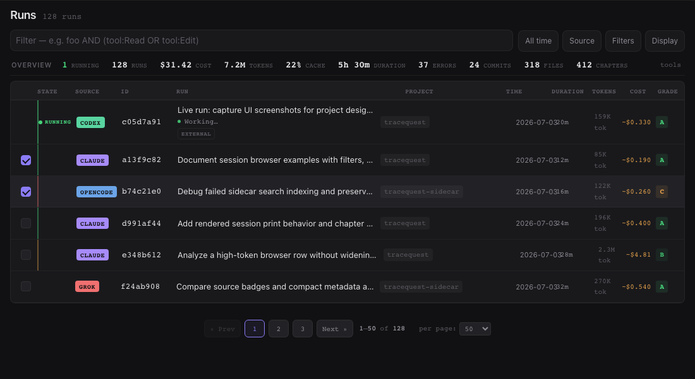
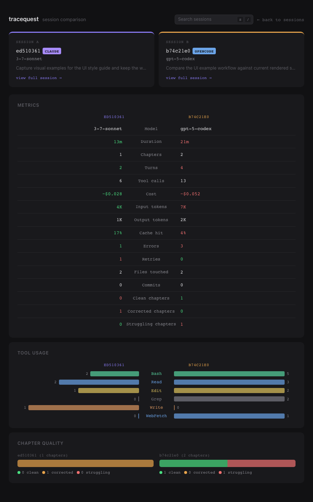
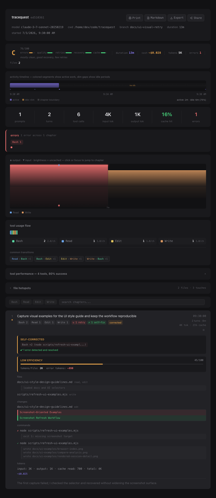

# Tracequest UI Style And Design Guidelines

This guide captures the style already present in the Tracequest UI. Use it when extending the browser index, compare view, or rendered session viewer so new work feels like the same product instead of a separate page.

## Guide Index

This guide is the entry point for Tracequest UI guidance. Start here for the shared product style, then use the companion guide or audit that owns the specific change area.

### Ownership And Change History

The UI guide package is maintained through facts, [docs/ui-maintenance-evidence-sync.md](ui-maintenance-evidence-sync.md), and concrete UI behavior changes. Add or update guide history only when a focused fact and evidence-sync pass show that the UI contract, companion docs, screenshots, tests, or review notes need to move.

### Code Source Of Truth

The current visual language is implemented in these files:

- `src/browser/shared-css-tokens.js` defines shared color, typography, and reset tokens.
- `src/browser/browser-page-build.js` defines the browser index layout, filters, dashboard, list rows, quick filters, and pagination.
- `src/browser/compare-page-css.js` defines the compare page layout and comparative data visuals.
- `src/render/render-session-rules.js` defines rendered session pages, chapter cards, stats, detailed panels, and analysis blocks.
- `src/render/render-session-css.js` adds print and PDF behavior for session pages.

### Companion Guides And Audits

Use these documents as the detailed source of truth for their slices:

- Visual system and theming: [docs/ui-visual-system-theming-guidelines.md](ui-visual-system-theming-guidelines.md) covers CSS custom property roles, semantic color use, typography, density, borders, radii, shadows, and token-introduction rules.
- Content density and disclosure: [docs/ui-content-density-progressive-disclosure-guidelines.md](ui-content-density-progressive-disclosure-guidelines.md) covers dense tables/lists, compact metric cards, expandable detail, bounded evidence snippets, truncation versus wrapping, and secondary trace metadata exposure.
- Information architecture and navigation: [docs/ui-information-architecture-guidelines.md](ui-information-architecture-guidelines.md) covers page hierarchy, route header and subtitle patterns, back links, reload controls, jump navigation, compare context, session identity, and dense trace grouping.
- Workflow and task flow: [docs/ui-workflow-task-flow-guidelines.md](ui-workflow-task-flow-guidelines.md) covers how users move from browser filtering to session drill-in, compare worksheets, rendered-session evidence, preserved route context, and route-vs-in-page decisions.
- Interaction and control state: [docs/ui-interaction-control-state-guidelines.md](ui-interaction-control-state-guidelines.md) covers buttons, links, search/filter controls, checkboxes, reload/live-update affordances, selected/focused/disabled/loading states, and hover affordances.
- Result states: [docs/ui-result-state-guidelines.md](ui-result-state-guidelines.md) covers how much evidence and action empty, loading, stale, error, and partial-data states should expose across browser index, compare, and rendered session surfaces.
- Anti-patterns and non-goals: [docs/ui-anti-patterns-and-non-goals.md](ui-anti-patterns-and-non-goals.md) lists the changes that conflict with Tracequest's utilitarian trace-analysis style and should be rejected or redirected to an existing pattern.
- Implementation vocabulary: [docs/ui-implementation-style-reference.md](ui-implementation-style-reference.md) names the reusable selector, token, state, and diagnostic vocabulary used by UI implementation files and tests.
- Maintenance evidence sync: [docs/ui-maintenance-evidence-sync.md](ui-maintenance-evidence-sync.md) routes future UI changes through companion docs, facts, screenshot examples, CSS/token checks, browser or Playwright coverage, route/result-state decisions, and implementation vocabulary updates.
- Design review note template: [docs/ui-design-review-note-template.md](ui-design-review-note-template.md) gives contributors a compact fill-in record for changed surface, applied guides, refreshed evidence, facts/tests, and screenshot or browser-test decisions.
- Data visualization and diagnostics: [docs/ui-data-diagnostics-guidelines.md](ui-data-diagnostics-guidelines.md) covers analytics canvases, timelines, minimaps, tool-flow sequences, metric summaries, and compare evidence displays.
- Rendered hover diagnostics: [docs/rendered-hover-diagnostics-audit.md](rendered-hover-diagnostics-audit.md) records rendered-session hover-helper decisions and checklist items.
- Route-state review: [docs/route-state-audit-checklist.md](route-state-audit-checklist.md) records browser, compare, and rendered-session route-state coverage, deferred follow-up triggers, and explicit future gaps.
- Live audit status: [docs/ui-live-final-audit.md](ui-live-final-audit.md) records the latest live UI audit pass and visual-state work intentionally deferred for now.

## Contributor Start Guide

For a new UI change, start with the surface that already owns the behavior: browser index/filtering in `src/browser/browser-page-build.js`, compare worksheet layout in `src/browser/compare-page-css.js`, rendered-session evidence in `src/render/render-session-rules.js`, rendered print behavior in `src/render/render-session-css.js`, or shared tokens in `src/browser/shared-css-tokens.js`. Check the matching screenshot in `docs/ui-examples/` before adding a new pattern; those images show the expected browser index, compare, and rendered-session density.

Use the smallest companion set that matches the change:

| Change starts in | Read first | Add only when the change touches |
| --- | --- | --- |
| Browser filters, sorting, live refresh, compare selection, pagination | [docs/ui-interaction-control-state-guidelines.md](ui-interaction-control-state-guidelines.md), [docs/ui-result-state-guidelines.md](ui-result-state-guidelines.md) | [docs/route-state-audit-checklist.md](route-state-audit-checklist.md) for fetch/stale/error shell behavior; screenshot refresh when the maintained browser example changes. |
| Compare worksheet, paired metrics, tool rows, missing-parameter errors | Compare section below, [docs/ui-data-diagnostics-guidelines.md](ui-data-diagnostics-guidelines.md), [docs/ui-result-state-guidelines.md](ui-result-state-guidelines.md) | [docs/route-state-audit-checklist.md](route-state-audit-checklist.md) for server-rendered load/error decisions; narrow browser coverage only for real layout overflow. |
| Rendered-session chapters, charts, hover helpers, minimaps, print output | [docs/ui-data-diagnostics-guidelines.md](ui-data-diagnostics-guidelines.md), [docs/rendered-hover-diagnostics-audit.md](rendered-hover-diagnostics-audit.md), print guidance below | [docs/ui-content-density-progressive-disclosure-guidelines.md](ui-content-density-progressive-disclosure-guidelines.md) for snippets/expansion; screenshot refresh when the rendered-session example changes. |
| Page hierarchy, back links, route context, drill-in flows | [docs/ui-information-architecture-guidelines.md](ui-information-architecture-guidelines.md), [docs/ui-workflow-task-flow-guidelines.md](ui-workflow-task-flow-guidelines.md) | [docs/ui-design-review-note-template.md](ui-design-review-note-template.md) when a route or workflow decision needs a persistent review note. |
| Tokens, selectors, reusable state names, docs-only package updates | [docs/ui-visual-system-theming-guidelines.md](ui-visual-system-theming-guidelines.md), [docs/ui-implementation-style-reference.md](ui-implementation-style-reference.md) | [docs/ui-maintenance-evidence-sync.md](ui-maintenance-evidence-sync.md) to decide whether facts, screenshots, tests, or companion backlinks also need updates. |

Use [docs/ui-design-review-note-template.md](ui-design-review-note-template.md) for the review record when the change has more than one affected surface, changes a route/result-state decision, skips screenshots or browser tests for a documented reason, or updates the docs package itself. Use [docs/ui-maintenance-evidence-sync.md](ui-maintenance-evidence-sync.md) after implementation to keep companion docs, facts, screenshots, and targeted tests aligned with the changed UI.

## Shared Tokens

Use the shared CSS custom properties instead of page-local colors whenever possible.

- Background hierarchy: `--bg` for the page, `--surface` for panels and rows, `--surface2` for hover states, inputs, nested controls, and active surfaces.
- Text hierarchy: `--fg` for primary text, `--fg2` for secondary labels and summaries, `--fg3` for muted metadata.
- Borders: use `--border` for normal panel and control boundaries. Strengthen borders with low-opacity white only on hover or active states.
- Accent: `--accent` is the primary interactive accent. Use it for active filters, focused inputs, links, copied states, and chart emphasis.
- Status colors: `--green`, `--orange`, and `--red` carry semantic meaning. Avoid using them for decoration.
- Typography: use `--sans` for prose and interface labels, `--mono` for identifiers, file paths, model names, counts, compact controls, and numeric metrics.

The product is dark-first. Print styles intentionally override tokens to a light, high-contrast theme, so new printable UI should be token-driven.

## Dense Session Workflows

Tracequest is an inspection tool for agent sessions. Prioritize scan density and fast comparison over marketing-style presentation.

- Keep reading surfaces narrow enough for scanning: compare uses about `860px` and rendered session about `960px`. The `/` Runs home is a full-width inventory table so the list is the product, not a centered landing card feed.
- Use compact headings. Current top-level titles are typically `15px` to `16px`; section titles are often `10px` to `12px`, uppercase, muted, and tracked.
- Keep session rows and chapter rows vertically economical. Rows should reveal identity, prompt, source/model, timing, tools, cost, error, and file signals without requiring expansion.
- Prefer progressive disclosure. Lists and chapters show summaries first, then expose details through expansion, hover, or drill-in links.
- Preserve tabular numerals for metrics, durations, costs, token counts, grades, and counts.

## Layout And Panel Geometry

Panels are quiet surfaces, not decorative cards.

- Use `--surface` with subtle `--border` and small radii. Existing panels usually use `8px` or `10px`; nested detail panels tend to use `4px` to `6px`.
- Avoid nested card-heavy layouts. A panel may contain compact chips, rows, or detail blocks, but pages should not become stacks of large decorative cards.
- Use tight spacing between repeated items. Session and chapter lists commonly use `2px` gaps so scanning feels continuous.
- Use flex wrapping for metadata and controls. Long paths, prompts, model names, and chips must truncate or wrap without pushing layout sideways.
- Use left borders sparingly for status emphasis on rows and detail blocks.

## Typography And Copy

The UI voice is direct, terse, and operational.

- Prefer short labels such as `tokens`, `cache`, `errors`, `commits`, `files`, `chapters`, `related chapters`, `changes`, and `searches`.
- Use lowercase labels for small metadata and detail-section names unless matching an existing uppercase section-title pattern.
- Use monospace for machine-readable values and compact controls: session IDs, paths, tools, filters, sort buttons, page controls, and numeric stat labels.
- Do not add explanatory marketing copy inside workflow surfaces. The interface should expose data and controls.

### Copy And Microcopy Patterns

Use the existing browser index, compare, and rendered session strings as the default vocabulary before adding a new phrasing style.

- status text should be compact and state-first. Browser live and selection copy uses short phrases like `refreshing`, `stale data`, `load failed`, `No sessions match`, and `Select 2 sessions to compare`; rendered-session share states use the same direct pattern with `Uploading…`, `Shared!`, `Token required`, or a concrete service failure.
- action labels should match the surface. Persistent page actions and route actions use clear verbs in title or sentence case, such as `Print`, `Markdown`, `Export`, `Share`, `Compare`, `Clear`, and `back to sessions`; inline filters and sort controls stay lowercase and compact, such as `recent`, `duration`, `tokens`, `errors`, `clear filters`, `show more`, and `collapse`.
- empty and error wording should say what happened, then expose the repair handle. Empty states stay neutral (`No sessions match`). Compare and rendered route errors use `Could not load ...`, `HTTP ...`, the failed session handle or `(missing)`, the server message, and `back to sessions`; missing compare parameters name the exact query parameter (`a` or `b`).
- timestamps and session labels should preserve scan order. Browser rows identify source, session ID, project/model, then relative time like `5m ago`, `2h ago`, or `3d ago`; rendered session headers use the session hash or short ID plus exact `started` metadata; compare keeps side identity structural and labels values with the session IDs rather than prose.
- command text and diagnostic snippets should keep raw evidence visible. Rendered detail sections use lowercase labels such as `commands`, `searches`, `changes`, `files`, `git`, `tokens`, and `thinking`; command/search rows keep the original command or query text, use check/error status marks, and collapse overflow with `… N more`, `show more`, or a truncated output block.
- placeholders and hints should teach syntax without becoming help copy. Keep query examples in the filter placeholder or legend (`Filter — e.g. foo AND (tool:Read OR tool:Edit)`, `search chapters...`, `project:`, `source:`, `host:`, `tool:`, `model:`), and keep empty/error states reserved for the current result or route state.

## Controls And Interaction

Controls are compact, stateful, and low-chrome.

- Buttons use inline-flex alignment, small gaps, mono text around `11px` to `12px`, `1px` borders, and `4px` to `6px` radii.
- Active filters use accent borders and a dim accent background. Disabled controls reduce opacity rather than changing shape.
- Hover states should be subtle: shift to `--surface2`, raise text from `--fg3` to `--fg2` or `--fg`, or strengthen the border.
- Inputs blend into surfaces: no heavy outlines, token colors, and accent-colored focus borders.
- Icons should stay small and subordinate to labels in current export/share/print style controls.

## Component Patterns

These patterns describe recurring UI pieces already used across the browser index, compare page, and rendered session viewer. Prefer extending these shapes before introducing a new component style.

### Filters And Query Controls

Filters are compact work surfaces, not search landing pages.

- Use one surface-level wrapper for each filter group: the browser index uses `.filter-bar` with `min-height: 42px`, `4px` gaps, and chip wrapping; the rendered session viewer uses a slightly tighter `.filter-bar` with chips, a search input, and a count.
- Let filter chips wrap inside the control instead of creating secondary rows outside the surface. Use mono labels, small radii, subtle fills, and visible active state via accent color and accent border.
- Keep keyboard and query hints small and dismissive. The browser `/` hint is a muted mono pill that disappears on focus; do not make hints compete with results.
- Suggestions should feel attached to the filter. Use an absolutely positioned dropdown below the filter surface, the same `--surface` and `--border`, a high z-index, and hover/highlight rows using `--surface2`.
- Counts belong at the right edge or end of the filter row as muted mono metadata. They should not become primary headings.
- Search inputs must have `min-width` constraints and flex growth so long query chips, source filters, or tool filters wrap without horizontal overflow.

### Dashboards And Metrics

Dashboards summarize the current result set and should remain dense.

- Use a single quiet panel with `--surface`, `--border`, a `10px` radius, and compact padding. The browser dashboard uses `16px 20px`; avoid larger card spacing.
- Titles are operational labels: uppercase, muted, about `12px`, and paired with a mono scope label when the metric set is filtered.
- Metric groups use responsive grids with small minimum tracks rather than fixed columns. Preserve tabular numerals, ellipsis on long values, and short uppercase labels.
- Growth, status, and grade signals use semantic colors only: green for improvement or healthy state, red for decline or errors, orange for cost/waste/warning.
- Tool summaries are secondary. Put them below the main stats behind a top border, as wrapping mono chips with counts at reduced opacity.
- Collapsed dashboards should hide metric bodies without changing the surrounding page structure; the toggle stays small, muted, and aligned to the header end.

### Session Rows And Lists

Session rows carry most of the browser experience. Keep them stable and scan-first.

- Rows are full-width links inside a narrow container, separated by `2px` vertical gaps. Use `--surface`, `8px` radius, and `--surface2` hover.
- The top line should identify the session first, then show compact model/project/source metadata, status badges, and right-aligned time or size. Use flex wrapping so long metadata drops instead of widening the row.
- Prompts are one-line summaries in list contexts. Use `overflow: hidden`, ellipsis, and `white-space: nowrap`; reveal longer content in detail views, not list rows.
- Stats sit below the prompt as small mono inline groups with tabular numerals. Use existing stat semantics for errors, tokens, commits, files, duration, and cost.
- Use a left border for row-level severity or emphasis. Error wins over commit or expensive states when multiple row statuses are present.
- Badges should be short and machine-like. Source badges are uppercase, grade badges are bold mono, and count badges stay visually smaller than identifiers.
- Compare checkboxes and selection controls sit outside or beside the row without changing row height or prompt alignment.

### Chapter And Detail Views

Chapter views are progressive disclosure around one user request and its resolution.

- Chapter lists use the same repeated-surface rhythm as sessions: `2px` gaps, quiet surfaces, and hover/expanded background change.
- A chapter header has four zones: number/outcome marker, prompt and metadata, compact status/pattern chips, and right-aligned time/turn/token metrics.
- Clamp chapter prompts in collapsed state and expand the text in place. Do not replace the row with a separate detail page for routine inspection.
- Detail content is indented under the header, not rendered as unrelated cards. Existing details use `padding: 0 20px 16px 52px` to preserve alignment with the prompt body.
- Quality, efficiency, retry, command, file, MCP, web, and diff blocks use small nested panels or rows. Prefer left borders and compact labels over large headers.
- Long command output, diffs, prompts, and MCP output must wrap and cap height in collapsed form; expanded state may reveal more while preserving mono formatting.
- Permalinks, waveform hover, and keyboard focus are local states. Use accent left borders or subtle background shifts, and keep permanent visual noise low.

### Modals And Overlays

Modals are reserved for focused actions such as sharing, not for routine filtering or browsing.

- Use a fixed full-viewport overlay with a dark translucent backdrop and centered modal panel. Current share modals use `rgba(0, 0, 0, 0.6)` and z-index above page controls.
- Modal panels use `--surface`, `--border`, a `12px` radius, constrained width around `400px`, and `max-width: 90vw`.
- Titles are compact (`15px`, semibold). Labels, hints, and status lines are smaller, with status colors limited to green success and red error.
- Inputs inside modals use `--surface2`, mono text for URLs or identifiers, and accent focus borders.
- Actions align to the end. Primary actions use an accent-tinted fill and border; secondary actions use `--surface2` and muted text. Disabled actions lower opacity without layout movement.
- Hide modal overlays in print and avoid adding modal-only content that is required for printed session understanding.

### Buttons And Compact Controls

Buttons and controls should read as tools in an inspection workspace.

- Sort buttons, quick filters, share/copy controls, pagination, and dashboard toggles all use small mono text, tight padding, and modest radii.
- Active controls use accent text, accent border, and a dim accent background. Hover should only strengthen text, background, or border slightly.
- Destructive or corrective micro-actions, such as chip removal, can stay invisible until hover when the surrounding chip already identifies the action target.
- Preserve button dimensions across state changes. Active, disabled, copied, and loading states should not shift nearby labels or rows.
- Use text labels for domain-specific commands such as `recent`, `duration`, `tokens`, `errors`, `Compare`, and `Clear`; reserve icons for familiar actions such as copy, export, print, or share.
- Control clusters wrap with the content they affect. Avoid fixed-width toolbars that detach filters, sort order, and pagination from the visible result set.

## Compare View Design Patterns

The compare page is a diagnostic worksheet, not a dashboard of independent cards. Its layout is intentionally symmetric: session identity comes first, then metric-by-metric evidence, then visual summaries that help explain the numeric rows.

### Paired Session Panels

- Keep `.cmp-sessions` as the first evidence block under the header. The two `.cmp-session` panels establish the comparison contract before any table or chart appears.
- Preserve side identity through placement and a thin top border: session A uses `--accent`, session B uses `--orange`. Do not fill the whole panel with side color or add large A/B badges.
- Session cards should remain parallel in information order: side label, session hash or ID, source badge, short model, prompt excerpt, then `view full session`. If one side gains a field, the other side should reserve the same structural position.
- Keep prompts one line in the paired cards. Long prompt text belongs in the full session view; the compare page needs enough context to distinguish sessions without turning the cards into transcripts.
- Source badges may use source-specific colors, but they stay small, uppercase, and adjacent to the session ID. They should not compete with the A/B border colors.

### Comparative Metric Tables And Deltas

- Use the centered-label table pattern from `.cmp-table`: A values align right, B values align left, and the metric label sits between them. This creates a visual hinge so users can scan across a row without a separate legend.
- Keep metric labels short and mono: `Duration`, `Turns`, `Cost`, `Errors`, `Clean chapters`. Avoid prose labels that make the center column wider than the current `160px` desktop / `100px` mobile rhythm.
- Apply green/red delta coloring only for rows with an explicit preference. Current compare logic treats lower as better for duration, turns, cost, input tokens, errors, retries, corrected chapters, and struggling chapters; higher as better for cache hit and clean chapters; and no winner for model, chapters, tool calls, output tokens, files touched, and commits.
- Ties and `none` preference rows should have no delta color. A difference is not automatically a win; the UI should only mark good/bad when the metric has a defensible direction.
- Preserve tabular numerals and mono formatting on all values so changes in cost, token, duration, and count width do not disturb row scanning.

### Mirrored Tool Bars

- Tool usage bars are comparison bars, not ranked progress meters. Keep the `.tool-cmp-row` grid as left value, centered tool name, right value.
- Mirror A-side bars with `row-reverse` so both bars grow outward from the tool name. Users should be able to compare shape and count together without moving their eyes to a legend.
- Scale each tool row against that row's larger side, as `buildToolComparisonHtml` does. Do not normalize every tool against the global maximum unless the design also adds a clear axis, because global scaling would hide smaller but meaningful per-tool differences.
- Keep tool labels colored by tool family, with unknown tools muted and MCP tools formatted to a readable server/tool label. Counts stay neutral mono text; the bar color identifies the tool, not the winner.
- Limit visible tool rows to the most active tools unless a drill-in is added. The current default cap of 12 keeps the compare page compact and avoids turning sparse tool data into a long inventory.

### Chapter-Quality Bars

- Use compact segmented bars for chapter outcome composition: green clean, orange corrected, red struggling. The segment order should remain stable across both sessions.
- Pair every color segment with text counts in the legend. Zero values remain visible as text even when their segment width is `0%`.
- Keep the chapter-quality area below metrics and tool usage. It explains quality distribution after users have already seen session-level volume, cost, cache, retry, and error context.
- Empty chapter data should render as a quiet empty bar plus `0 clean`, `0 corrected`, and `0 struggling`, not as an error panel. Lack of chapters is data quality context, not a visual failure state by itself.

### Empty, Error, And Sparse States

- Sparse compare data should collapse quietly. If there are no tool rows, the Tool usage section may remain structurally present but should not invent placeholder bars or decorative empty cards.
- Missing model, duration, or cost values use the existing value fallbacks such as `-` or `0`, preserving table geometry. Do not replace individual cells with warnings that break alignment.
- The `Errors` metric is the compare page's error signal. Let the red `delta-bad` value carry severity when one side has more errors; add a separate error block only if there is actionable detail from both sessions that cannot fit in the metric row.
- If a future compare route cannot load one or both sessions, use one compact surface in the compare page shell with the failed handle and a back link. Do not render half of the worksheet, because all comparative charts assume two valid summaries.
- Missing compare route parameters are route errors, not sparse data. Keep them in the compact compare error shell and name the missing query parameter (`a` or `b`) so users can repair shared URLs without scanning server logs.

### Visual Hierarchy

- Preserve the current reading order: header, paired session cards, Metrics, Tool usage, Chapter quality. This moves from identity to numeric verdicts to explanatory visuals.
- Keep `.cmp-section` surfaces visually equal. The metric table gets priority through position and density, not a louder card style.
- Use side colors only for A/B identity in headers and cards. Use semantic colors for judgment and outcome: green/red for good/bad deltas, green/orange/red for chapter quality, tool-family colors for tool identity.
- Hover emphasis should only sharpen supporting marks, such as increasing tool bar opacity. Hover must not introduce winner styling, change bar length, or move counts.
- At the `600px` breakpoint, stack paired cards and chapter-quality sides while keeping the metric table symmetric. Narrow layouts should tighten the center label column rather than abandoning the A-label-B comparison structure.

## Accessibility, Focus, Keyboard, Print, And Responsive Behavior

Accessibility in Tracequest should reinforce the inspection workflow: keyboard users need the same fast filtering, navigation, expansion, sharing, and print paths as pointer users, while print and small screens must preserve the diagnostic content.

### Accessibility And Semantics

- Prefer native controls for interactive elements: anchors for session links, buttons for actions, inputs for search/filter fields, checkboxes for compare selection, and selects for page size. Add custom styling around those elements instead of replacing their semantics.
- Keep visible labels short, but make the accessible name explicit when the visible control is terse. Existing print/share/export controls pair icons with text or `title`; new icon-only controls should use an `aria-label`.
- Do not rely on color alone. Error, warning, success, grade, compare-side, and copied states should also have text, badges, borders, row position, or labels.
- Preserve the document shell basics already used by generated pages: `lang="en"`, `meta charset`, and `meta viewport`. New standalone UI output should include the same baseline.
- Long prompts, paths, command output, and model names should remain readable to assistive tech even when visually truncated. Truncate the rendered summary, not the underlying data needed by detail views, copy/export flows, or printed output.
- Modal overlays must keep the focused task clear: use one compact title, labeled inputs for URLs or identifiers, status text for success/error, and end-aligned actions. Escape should dismiss or clear local state consistently with the rest of the UI.

### Focus And Keyboard Behavior

- Preserve the global `/` shortcut for search-like filtering. It currently focuses the browser filter and the session chapter search; only intercept `/` when the user is not already typing in an input.
- Filter suggestions should support `ArrowDown` and `ArrowUp` to move the highlighted suggestion, `Enter` or `Tab` to accept it, and `Escape` to close suggestions, clear typed text, or blur the input in that order.
- Session chapter navigation uses `j` and `k` to move through visible chapters, `Enter` or `o` to expand/collapse the focused chapter, and `Escape` to clear focus or search state. New chapter-level tools should not steal those keys unless focus is inside their own input.
- Keep focus indicators local and quiet but visible. Current chapter keyboard focus uses an accent left border plus a subtle accent-tinted background; focused inputs use accent or strengthened borders.
- Avoid layout shifts on focus, hover, active, copied, loading, and disabled states. Focus treatment should change color, border, or background, not row height, grid width, or button text length.
- Pointer and keyboard paths should reach the same state. If a chip, row, dashboard toggle, modal action, permalink, or compare selector can be changed with a pointer, give it native keyboard behavior or an explicit keyboard handler.
- Do not leave permanent focus noise in printed output. The print stylesheet removes `.chapter.kb-focused`; follow that pattern for any future keyboard-only state.

### Print And PDF Behavior

- Session pages are first-class print/PDF artifacts. Any new rendered-session section should define its `@media print` behavior when it adds interactive controls, collapsed bodies, tooltips, fixed overlays, hover effects, or canvas-heavy visuals.
- Print should show diagnostic content, not controls. Existing print rules hide filter bars, search inputs, expand toggles, export/print/share/markdown buttons, modals, tooltips, minimaps, cursors, and transient badges.
- Print should expand what users would otherwise have to click. Chapters, tool performance bodies, file hotspots, long outputs, diffs, agent prompts, thinking blocks, and MCP output remove display and max-height constraints in print.
- Preserve compact visual evidence in print. Waveform, cost, and activity canvases stay visible with `max-width: 100%`; new charts should do the same or provide a textual fallback nearby.
- Use the light print token override and thin gray borders rather than dark surfaces or decorative colored left borders. Status meaning may remain in labels and content, but print should prioritize legibility.
- Avoid page breaks inside chapters and key summary panels with `break-inside: avoid` and `page-break-inside: avoid`. Add the same protection to new summary sections that are only useful when read as a unit.

### Responsive And Touch Behavior

- Keep the established breakpoint vocabulary: browser pages adapt at `900px` and `600px`, rendered session pages adapt at `768px`, and compare pages collapse paired session columns at `600px`.
- Prefer wrapping and hiding low-priority metadata over shrinking critical text. Current narrow browser rows hide model/project/source badges, tighten stat gaps, and remove page-size controls before compromising prompts or pagination.
- Collapse multi-column diagnostic layouts to one column when comparison would become cramped. Existing compare outcomes and rendered tool-flow summaries switch to single-column layouts on narrow screens.
- Inputs and filter surfaces should stretch to the available width on small screens. The rendered session search becomes `min-width: 100%`; browser filter chips wrap inside the same surface instead of forcing horizontal scroll.
- Touch targets may stay compact, but they need stable dimensions. Pagination buttons use fixed minimum width/height on mobile; future quick filters, row controls, and chapter actions should avoid tiny text-only hit areas.
- Hide hover-only helpers on touch-sized layouts. Existing chapter and minimap tooltips are disabled at the rendered-session mobile breakpoint; new hover diagnostics should either become tap-accessible or disappear without removing essential information.
- Long content must never widen the viewport. Use flex wrapping, max widths, ellipsis on summaries, and overflow control on code/output blocks instead of page-level horizontal scrolling.

## Screenshot-Oriented Examples

Use these examples as concrete visual references when changing UI. They were captured from existing builders and selectors, not separate mockups: `browserPageHTML` in `src/browser/browser-page-build.js`, `comparePage` in `src/browser/compare-page.js`, and `renderHTML` in `src/render.js`.

To refresh the examples after intentional UI changes, run `npm run docs:ui-examples`. The command uses `scripts/refresh-ui-examples.mjs` with synthetic non-private sessions and overwrites `docs/ui-examples/browser-index.png`, `docs/ui-examples/compare-analysis.png`, and `docs/ui-examples/rendered-session-detail.png`.

### Visual Review For Refreshed Examples

Use the refreshed PNGs as review artifacts, not as a separate visual diff test suite.

- Run `npm run docs:ui-examples` after UI changes that intentionally affect the browser index, compare page, or rendered session viewer examples.
- Changed screenshot files are review prompts. A PNG diff means the generated example changed; it does not automatically mean the UI regressed.
- Review each changed screenshot beside the code change and inspect the workflow-level shape: density, alignment, panel geometry, long-text truncation, status color semantics, focus/control states, chart readability, responsive assumptions, and print-relevant evidence for rendered session pages.
- Intentional diffs should be accepted when they match the product change and still satisfy the inspection notes below. Mention the visual impact in the review or commit summary so future reviewers know the screenshot churn was expected.
- Suspicious diffs should be investigated before approval: unexpected blank regions, missing charts, clipped text, widened containers, overlapping controls, shifted compare symmetry, changed status colors, or screenshot changes caused by unrelated code.
- If only screenshot pixels changed and no UI behavior or visual design changed, rerun the command once from a clean worktree before treating the diff as meaningful. Do not add a heavier visual diff framework unless screenshot churn repeatedly hides real regressions.

### Browser: session list and detail shell

Capture target: `.container` at a desktop viewport around `1100px` wide, using the browser index shell with dashboard, quick filters, live strip, sort controls, session rows, compare checkboxes, the fixed compare bar, and pagination visible.

Inspect:

- The filter, dashboard, quick-filter bar, sort bar, inventory table, and pagination read as one dense Runs workflow. The inventory table is the home surface; filters and stats sit in composed chrome above it.
- Session rows keep a stable left checkbox gutter, compact top metadata, one-line prompt, mono stat line, tool sparkline, and small tool chips.
- Severity remains visible without dominating the list: error rows use red left emphasis and badges, commit rows use green emphasis, high-token rows use orange cost badges.
- The fixed compare bar overlays the lower viewport as an action surface; it should not change row geometry or force the list wider.
- Long model/project labels and prompts truncate inside the row rather than widening the viewport.

### Compare: paired session analysis

Capture target: `.container` from the standalone compare page at a desktop viewport around `1100px` wide, with both session summary cards, metric table, tool comparison, and chapter-quality bars visible.

Inspect:

- The two session cards establish side identity through border-top color only: accent for session A and orange for session B.
- Metric rows use a centered mono label column, right-aligned A values, left-aligned B values, and semantic green/red deltas only where the comparison outcome needs emphasis.
- Tool rows mirror horizontally around the tool name so the eye can compare count and bar length without reading a legend first.
- Chapter quality uses compact segmented bars plus text counts; green, orange, and red retain the same clean/corrected/struggling meaning used elsewhere.
- At narrow widths, this example should collapse paired cards and outcome columns without changing the metric table's scan-first rhythm.

### Rendered session: print-ready conversation detail

Capture target: `#app` from a rendered session page at a desktop viewport around `1100px` wide, after expanding the first chapter. The visible state includes header actions, summary grade, activity timeline, stats, error summary, waveform, tool flow, cost chart, file hotspots, chapter filter bar, and expanded chapter detail.

Inspect:

- The rendered page uses a wider inspection column than the browser index while keeping each diagnostic band full-width and un-nested.
- Header actions stay compact and right-aligned; the primary page signal remains the session identity and metadata, not the buttons.
- Charts are diagnostic bands, not decoration: waveform, activity, tool-flow, and cost visuals sit close to their labels and use muted surrounding chrome.
- Expanded chapter detail stays aligned under its chapter header, with low-efficiency, files, changes, commands, tokens, and response text grouped as compact evidence.
- Print/PDF behavior should preserve this evidence while hiding transient controls; changes to any visible band here need an explicit print check.

## Status Semantics

Status color is meaningful and should stay consistent.

- Green means healthy, completed, live, successful, efficient, commit-related, or improved.
- Orange means warning, correction, moderate efficiency, cost, or second-side compare emphasis.
- Red means error, failed, struggling, high-risk, or wasteful.
- Purple/accent means selected, focused, copied/permalink, primary session compare side, or Tracequest brand accent.
- Source badges can use source-specific colors, but badges should remain compact, uppercase, and high-contrast.

Do not introduce unrelated semantic colors unless the UI needs a new status category that cannot be expressed by these meanings.

## Chips, Badges, And Metadata

Small labeled elements are a core pattern.

- Chips and badges use mono text, compact padding, subtle fills, and small radii.
- Counts inside chips should be visually secondary with opacity or muted color.
- Tool names, source names, grade badges, quick filters, session stats, and chapter patterns should remain scannable at small sizes.
- When content is long, truncate with ellipsis and keep the surrounding row stable.

## Charts And Print

Charts and visual summaries should support diagnosis, not decoration.

- Favor compact, inline visualizations: sparklines, segmented bars, small outcome bars, waveform canvases, and grid-like timelines.
- Use existing semantic colors for chart segments and legends. Reduce opacity when the chart is supporting context rather than the primary reading target.
- Keep tooltips small, mono, and close to the chart element.
- Session pages must remain print/PDF friendly. Hide interactive-only controls and tooltips in print, expand chapter detail, remove hover effects, use light token overrides, and avoid page breaks inside chapters and key summary panels.

## Responsive Behavior

Mobile behavior should preserve utility rather than simplify the product into a different experience.

- Keep controls wrapping instead of overflowing. Existing breakpoints around `600px` and `900px` reduce control sizes, hide low-priority page-size controls, and tighten metadata.
- Collapse two-column compare layouts to one column on small screens.
- Preserve prompt and path truncation. Long content should not widen the viewport.
- Maintain tappable controls with stable dimensions, especially pagination, quick filters, and row actions.

### Responsive And Print Coverage Triggers

Keep responsive and print tests scoped to the risk the UI change creates.

- CSS-only checks are enough when the contract is a selector, breakpoint, media query, truncation property, print hide/show rule, or token override that can be proven by inspecting generated CSS.
- Add a narrow-viewport Playwright test when the risk depends on browser layout: horizontal overflow, clipped long labels, fixed overlays, wrapping control bars, mirrored compare rows, canvas sizing, or an interactive state that only appears after real DOM measurement.
- Add print-specific coverage when rendered-session changes alter printed diagnostic evidence, add content that must expand for print, introduce controls/tooltips/overlays that must disappear, or add charts/canvases that need a printable visual or nearby textual fallback.
- Do not add browser coverage for every breakpoint. Prefer one focused narrow-width smoke for a concrete layout contract, such as the compare long-label overflow case, and keep route/static-shell states in route tests unless they gain meaningful browser-only interaction.

## Future UI Change Review Checklist

Use this as a pre-merge rubric after reading the relevant section above. It is intentionally short: cite the section or linked audit that applies instead of repeating the full rule set in a PR or commit note.

Route detailed review through the Guide Index: visual tokens and density use `docs/ui-visual-system-theming-guidelines.md`; content density, expansion, snippets, truncation, and secondary trace metadata use `docs/ui-content-density-progressive-disclosure-guidelines.md`; hierarchy, navigation, and session identity use `docs/ui-information-architecture-guidelines.md`; cross-surface workflow and route-vs-in-page decisions use `docs/ui-workflow-task-flow-guidelines.md`; controls and local state use `docs/ui-interaction-control-state-guidelines.md`; empty/loading/stale/error/partial-data depth uses `docs/ui-result-state-guidelines.md`; anti-pattern and non-goal decisions use `docs/ui-anti-patterns-and-non-goals.md`; charts and diagnostic evidence use `docs/ui-data-diagnostics-guidelines.md`; selectors and test hooks use `docs/ui-implementation-style-reference.md`; route shells and refresh behavior use `docs/route-state-audit-checklist.md`; rendered hover helpers use `docs/rendered-hover-diagnostics-audit.md`; maintenance evidence routing uses `docs/ui-maintenance-evidence-sync.md`.

- component consistency: The change reuses the established surface, row, chip, compact-button, filter, dashboard, compare-table, chart, or chapter-detail pattern before introducing a new shape. Any new variant names the existing pattern it extends and still uses shared tokens, status colors, compact spacing, and stable dimensions; selector names and state vocabulary follow `docs/ui-implementation-style-reference.md`.
- visual system and theming: New CSS follows `docs/ui-visual-system-theming-guidelines.md`: use shared tokens for semantic color, text, border, and font roles; keep one-off geometry and category colors local; add root tokens only when repeated cross-surface use or print overrides justify them.
- state coverage: Happy, empty, sparse, loading, stale, error, active, disabled, copied, expanded/collapsed, hover, focus, narrow-width, and print states are handled where they apply. For evidence/action depth in result states, apply `docs/ui-result-state-guidelines.md`; for buttons, links, search/filter controls, checkboxes, reload/live-update affordances, and ambiguous command-vs-navigation cases, apply `docs/ui-interaction-control-state-guidelines.md`. Do not add a partial worksheet, blank panel, or hover-only diagnostic unless the authoritative non-hover state is clear.
- accessibility and keyboard: Interactive UI uses native controls or explicit roles, accessible names, visible focus, and keyboard parity for pointer actions. Search/filter changes preserve `/`, `Escape`, arrow-key, `Enter`, and chapter navigation behavior where those shortcuts already apply; rendered hover helpers follow `docs/rendered-hover-diagnostics-audit.md`.
- screenshot visual review: Run or deliberately skip `npm run docs:ui-examples` based on whether the browser index, compare page, or rendered session example should visually change. Review changed PNGs for density, alignment, truncation, status color meaning, chart readability, compare symmetry, and print-relevant rendered-session evidence.
- copy and labeling: New text follows the Copy And Microcopy Patterns above: terse operational status, surface-appropriate action labels, neutral empty states, concrete error handles, established timestamp/session-label order, and raw command snippets preserved as evidence.
- route-state decisions: For browser, compare, or `/view` shell changes, update or cite `docs/route-state-audit-checklist.md`; for route hierarchy, session identity, or jump-state preservation, use `docs/ui-information-architecture-guidelines.md`. Name whether the route is server-rendered, client-refreshed, stale-data preserving, or an error shell, and avoid adding screenshots for compact static route errors unless the checklist trigger is met.
- non-goals and anti-patterns: Check `docs/ui-anti-patterns-and-non-goals.md` before accepting a new page shape, token family, route shell state, empty/error explanation, screenshot, or browser test that is not clearly tied to trace inspection evidence.
- facts/tests evidence: Add or update a focused fact before changing project behavior, verify it with `facts check --tags "<target>"`, manually verify any `?` facts by reading the relevant files, and pair the change with the smallest meaningful route, render, browser, Playwright, print, CSS-only, or screenshot-refresh test. Use the responsive and print coverage triggers above to avoid both under-testing real layout risk and over-testing plain CSS contracts.
